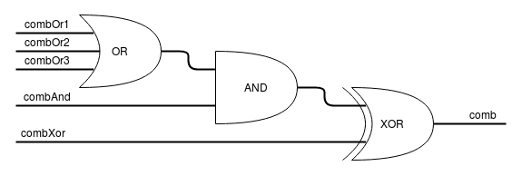

PyChronos
=========

This project includes the python bindings and camera control software for the
Chronos High Speed Cameras. The camera uses an FPGA to handle the recording of
high-speed video, storage of the video data and playback of video to the CPU.
This project mainly deals with the task of operating the FPGA, image sensor,
and the recording of video into video data. Reading video data out of the FPGA
and rendering it to the various display interfaces is managed by the 
[chronos-cli](https://github.com/krontech/chronos-cli) project.

This project includes several major components:
 * `libpychronos`: C-to-Python bindings that provide an abstraction for the FPGA
   and other hardware assets on the Camera. This is an internal module that you
   shouldn't need to access directly.
 * `pychronos`: A python module which provides a collection of classes and sub-
   modules for the various parts of the camera. Notable groups include:
   * `regmaps`: Classes which represent various register groups in the FPGA.
   * `sensors`: Classes which represent the image sensors supported on the camera.
   * `camera`: A class which represents the state machine of the camera.
 * `cam_control`: A D-Bus binding program which exports an API to manipulate
   the `camera` class.


Building and Installing
-----------------------
**To build the `pychronos` module**, you will need the `python3-dev` and `python3-dbus`
packages for your camera's operating system. Once installed, you can use the `setup.py`
script to build and install the module on your camera, using the following commands:
 * `python3 setup.py build` to build the pychronos package from your checkout.
 * `python3 setup.py install` to install the pychronos package on your camera.

**For quick development**, you can also use `make inplace` to generate an in-place
version of the `pychronos` package that can be imported from the root of the
project checkout without installing to the system.

As much as we love backwards compatibility, the `pychronos` module required Python
version 3.4 and newer. This is due to extensive use of generator functions to handle
cooperative multithreading for long-running tasks.

**To build the documentation**, you will need the following prereqs installed on your
computer. For example, on linux,
```
sudo apt install python3 build-essential python3-sphinx sphinx-doc python3-numpy
```

**To run the API webserver**, you will need the following additional packages.
They can be installed on the camera by running
```
apt install python3-twisted python3-txdbus
```

In the base folder of the project, you can then build the documentation. This
build will be output to the `~/docs` folder, so that [github
pages](https://krontech.github.io/pychronos/) recognises it and
serves it to the world.
```
make inplace
cd docs_src
make html #-OR-
make watch html #for development
```


Chronos Control Interface
=========================
The D-Bus API to the `cam_control` program is expressed as a set of parameters most
of which can be queried via a `get` command, updated via a `set` command. Or, when
updated internally by the camera, may emit a `notify` signal. For each parameter
listed, the `G`, `S`, and `N` columns indicate which of these operations a parameter
supports.

Some settings can be expressed in mutiple encodings, in which case there are multiple
parameters which all set the same underlying value. Each of these encodings support
the `get` and `set` methods but typically only one will emit a `notify` signal on change.
As an example, the exposure can be expressed either as a unit of time via the `exposurePeriod`
parameter, as a ratio between minimum and maximum via the `exposurePercent` parameter,
or as a fraction of the frame period via the `shutterAngle`. Setting exposure via any
of these parameters is allowed, but only the `exposurePeriod` will be reported in a
`notify` signal.

The parameters are further divided into the following subgroups:
 * Lens Control Group
 * Exposure Control Group
 * Gain Control Group
 * Display Group
 * Camera Information Group
 * Sensor Information Group
 * Camera Status Group
 * Color Space Group
 * Recording Group

Each parameter is marked with the following flags:

 * `G`: The parameter's current value can be queried via the `get` command.
 * `S`: The parameter's value can be updated via the `set` command.
 * `N`: Changes to the parameter's value will be reported via the `notify` signal.
 * `x`: The parameter is planned, but not yet implemented.

Each parameter also defines a type as follows:

| API Type | D-Bus Signatures   | Python Types | Description
|:---------|:-------------------|:-------------|:-----------
| `bool`   | `b`                | `boolean`    | Either `true` or `false`.
| `float`  | `t`                | `float`      | Floating-point number.
| `int`    | `i`                | `int`        | Integer type, supporting up to 32-bit precision.
| `enum`   | `s`                | `str`        | The description of each type must specify the allowed values.
| `array`  | `ad`               | `list`       | An array of floating point values.
| `string` | `s`                | `str`        | A character string, which should support UTF-8 encoding.
| `dict`   | `a{sv}`            | `dict`       | An array of name/value pairs. Values may contain any type (including another `dict`).

### Focus Control Parameters
This is pure speculation - nothing is really implemented here until we get
electronic lens control up and running.

| Parameter         | G | S | N | Type   | Min   | Max   | Description
|:------------------|:--|:--|:--|:-------|:------|:------|:-----------
| `focusPercent`    | x | x | x | float  | 0.0   | 100.0 | 0.0 for the nearest possible focus and 100.0 for furthest focus (infinity).
| `focusNormalized` | x | x |   | float  | 0.0   | 1.0   | 0.0 for the nearest possible focus and 1.0 for furthest focus (infinity).
| `focusDistance`   | x | x |   | float  |       |       | Distance to the focus subject in meters.
| `apertureFStop`   | x | x | x | float  |       |       | Aperture value where Fnumber = sqrt(2^AV).
| `aperturePercent` | x | x |   | float  | 0.0   | 100.0 | Aperture size as a percentage from 0 (smallest), to 100 (widest).

### Exposure Control Parameters
| Parameter            | G | S | N | Type   | Min   | Max   | Description
|:---------------------|:--|:--|:--|:-------|:------|:------|:-----------
| `exposurePeriod`     |`G`|`S`|`N`| int    |       |       | Exposure time in nanoseconds.
| `exposurePercent`    |`G`|`S`|   | float  | 0.0   | 100.0 | Exposure time as a percentage of way between the minimum (0%) and maximum (100%) exposures, at the current resolution.
| `exposureNormalized` |`G`|`S`|   | float  | 0.0   | 1.0   | As with `exposurePercent`, but between 0 and 1 instead of 0 and 100.
| `shutterAngle`       |`G`|`S`|   | int    | 0     | 36000 | Exposure time relative to frame period in hundredths of degrees.
| `exposureMin`        |`G`|   |`N`| int    |       |       | Minimum exposure time at the current resolution and frame period.
| `exposureMax`        |`G`|   |`N`| int    |       |       | Maximum exposure time at the current resolution and frame period.
| `exposureMode`       |`G`|`G`|`G`| enum   |       |       | Frame exposure mode as one of `normal`, `frameTrigger`, `shutterGating`, `hdr2slope`, `hdr3slope`.

### Gain Control Parameters
| Parameter         | G | S | N | Type   | Min   | Max   | Description
|:------------------|:--|:--|:--|:-------|:------|:------|:-----------
| `currentIso`      |`G`|`S`|   | int    |       |       | ISO number of the sensor at the current gain setting.
| `currentGain`     |`G`|`S`|`N`| int    |       |       | The gain as a multiplier of the `sensorIso` parameter.

### Display Parameters
These API parameters are proxy values for the equivalent parameters in the D-Bus
API to the `chronos-cli` program.

| Parameter           | G | S | N | Type   | Min   | Max   | Description
|:--------------------|:--|:--|:--|:-------|:------|:------|:-----------
| `overlayEnable`     |`G`|`x`|`x`| bool   |       |       |
| `overlayFormat`     |`G`|`x`|`x`| string |       |       | A `printf`-style format string to set the overlay text.
| `zebraLevel`        |`x`|`x`|`x`| float  | 0.0   | 1.0   | Fraction of the pixel's full scale value at which to apply zebra stripes.
| `focusPeakingLevel` |`x`|`x`|`x`| float  | 0.0   | 1.0   | Focus peaking edge detection sensitivity (0 to disable, or 1.0 for maximum).
| `focusPeakingColor` |`G`|`x`|`x`| enum   |       |       | One of Red, Green, Blue, Cyan, Magenta, Yellow, White and Black.
| `videoState`        |`G`|   |`x`| enum   |       |       | One of `paused`, `live`, `playback` or `filesave`.
| `playbackRate`      |`G`|`x`|`x`| int    |       |       | Framerate for plabyack when `videoState` is in `playback`.
| `playbackPosition`  |`G`|`S`|   | int    |       |       | Current frame number being displayed.
| `playbackStart`     |`G`|`S`|`N`| int    |       |       | Initial frame to display when `videoStart` enters `playback`.
| `playbackLength`    |`G`|`S`|`N`| int    |       |       | Number of frames to play back before returning to `playbackStart`.

### Camera Info Parameters
| Parameter         | G | S | N | Type   | Min   | Max   | Description
|:------------------|:--|:--|:--|:-------|:------|:------|:-----------
|`cameraApiVersion` |`G`|   |   | string |       |       | The string "0.9" for this release of the API specification.
|`cameraFpgaVersion`|`G`|   |   | string |       |       | The major and minor version numbers of the FPGA image.
|`cameraMemoryGB`   |`G`|   |   | float  |       |       | Amount of RAM installed, in units of `GiB`.
|`cameraModel`      |`G`|   |   | string |       |       | Camera model number (eg: "CR14-1.0").
|`cameraSerial`     |`G`|   |   | string |       |       | Camera unique serial number.
|`cameraDescription`|`G`|`S`|`N`| string |       |       | User description of camera.
|`cameraIdNumber`   |`G`|`S`|`N`| int    |       |       | User-assigned camera number for ordering and identification.
|`cameraTallyMode`  |`G`|`S`|`N`| enum   |       |       | Control of the recording LEDs as one of `auto`, `off`, `top`, `back` or `on`.

### Sensor Info Parameters
| Parameter           | G | S | N | Type   | Min   | Max   | Description
|:--------------------|:--|:--|:--|:-------|:------|:------|:-----------
|`sensorName`         |`G`|   |   | string |       |       | Descriptive string of the image sensor.
|`sensorColorPattern` |`G`|   |   | string |       |       | String of ‘R’ ‘G’ and ‘B’ that defines the color filter pattern in left-to-right and top-to-bottom order or ‘mono’ for monochrome sensors.
|`sensorBitDepth`     |`G`|   |   | int    |       |       | Number of bits per pixel as recorded by the image sensor.
|`sensorIso`          |`G`|   |   | int    |       |       | Base ISO of the image sensor at a gain of 1x (or 0 dB).
|`sensorMaxGain`      |`G`|   |   | int    |       |       | Maximum gain of the image sensor as a multiple of `sensorIso`.
|`sensorPixelRate`    |`G`|   |   | int    |       |       | Approximate pixel rate of the image sensor in pixels per second.
|`sensorVMax`         |`G`|   |   | int    |       |       | Maximum vertical resolution of the image sensor.
|`sensorVMin`         |`G`|   |   | int    |       |       | Minimum vertical resolution of the image sensor.
|`sensorVIncrement`   |`G`|   |   | int    |       |       | Minimum quantization of vertical resolutions.
|`sensorHMax`         |`G`|   |   | int    |       |       | Maximum horizontal resolution of the image sensor.
|`sensorHMin`         |`G`|   |   | int    |       |       | Minimum horizontal resolution of the image sensor.
|`sensorHIncrement`   |`G`|   |   | int    |       |       | Minimum quantization of horizontal resolutions.
|`sensorVDark`        |`G`|   |   | int    |       |       | Number of vertical dark rows (not included in sensorVMax).

### Camera Status Parameters
| Parameter                                  | G | S | N | Type   | Min   | Max   | Description
|:-------------------------------------------|:--|:--|:--|:-------|:------|:------|:-----------
|`state`                                     |`G`|   |`N`| enum   |       |       | One of `idle`, `recording`, `reset` and others???? TBD.
|`error`                                     |   |   |`x`| string |       |       | Included in a notification dictionary if, and only if, an operation fails due to an error.
|`externalStorage`                           |`G`|   |   | dict   |       |       | Dictionary of dictionaries describing the external storage devices.
|`dateTime`                                  |`G`|`x`|`x`| string |       |       | ISO-8601 formatted date and time string.

### Power and Battery Parameters
| Parameter                                  | G | S | N | Type   | Min   | Max   | Description
|:-------------------------------------------|:--|:--|:--|:-------|:------|:------|:-----------
|`externalPower`                             |`G`|   |`N`| bool   | False | True  | True when the AC adaptor is present, and False when on battery power.
|`batteryPresent`                            |`G`|   |`N`| bool   | False | True  | True when a battery is present, and False when there is no battery.
|`batteryCritical`                           |`G`|   |`N`| bool   | Fale  | True  | True when operating on battery power and the battery charge becomes critically low.
|`batteryChargeNormalized`                   |`G`|   |   | float  | 0.0   | 1.0   | Estimated battery charge, with 0.0 being fully depleted and 1.0 being fully charged.
|`batteryChargePercent`                      |`G`|   |   | float  | 0.0   | 100.0 | Estimated battery charge, with 0% being fully depleted and 100% being fully charged.
|`batteryVoltage`                            |`G`|   |   | float  | 0.0   |       | A measure of the power the removable battery is putting out, in volts. A happy battery outputs between 12v and 12.5v. This value is graphed on the battery screen on the Chronos.
|`powerOnWhenMainsConnected`                 |`G`|`S`|`N`| bool   | False | True  | Set to `True` to have the camera turn itself on when it is plugged in.
|`powerOffWhenMainsLost`                     |`G`|`S`|`N`| bool   | False | True  | Set to `True` to have the camera turn itself off when mains power is disconnected.
|`backlightEnabled`                          |`x`|`x`|`x`| bool   |       |       | True if the LCD on the back of the camera is lit. Can be set to False to dim the screen and save a small amount of power.
|`fanOverride`                               |`G`|`S`|`N`| bool   | False | True  | Set to `True` to turn the fan off if it is safe to do so, or set to `False` to let the camera control the fan speed.

### Camera Network Parameters
| Parameter         | G | S | N | Type   | Min   | Max   | Description
|:------------------|:--|:--|:--|:-------|:------|:------|:-----------
|`networkInterfaces`|`x`|   |   | dict   |       |       | Dictionary of dictionaries describing the network interfaces.
|`networkHostname`  |`G`|`S`|   | string |       |       | Hostname to be used for system calls, DHCP requests, etc.

### Color Space
TODO: As a longer term plan, these parameters should be moved into the display
group and made more a part of the video display system.

| Parameter         | G | S | N | Type   | Min   | Max   | Description
|:------------------|:--|:--|:--|:-------|:------|:------|:-----------
|`wbColor`          |`G`|`S`|`N`| array  |       |       | Current Red, Green, and Blue channel gains applied to the video stream.
|`wbCustomColor`    |`G`|`S`|`N`| array  |       |       | Custom Red, Green and Blue channel gains to achieve white balance.
|`wbTemperature`    |`G`|`S`|`N`| int    | 1800  | 10000 | Color temperature, in degrees Kelvin, to use for white balance, or zero to use `wbCustomColor`
|`colorMatrix`      |`G`|`S`|`N`| array  |       |       | Array of 9 floats describing the 3x3 color matrix from image sensor color space in to sRGB, stored in row-scan order.

### IO Group
The camera has a programmable IO block that allows the user to connect any IO function to
a selection of available signals. Several fixed function blocks are provided that can be
combined to modify the behavior of IO signals on the camera.

The combinatorial logic block combines up to 5 inputs through a series of AND, OR and XOR
gates to form simple logic circuits. The boolean logic diagram of the combinatorial
logic block is shown below:


The programmable delay block uses a bucket-brigade memory block to delay its input
waveform by a programmable number of clocks. This block also includes a prescaler which
can extend the delay time at the expense of precision.

The toggle block operates a flip-flop whose input can be set, cleared, or inverted whenever
a rising edge is detected on one if its input signals.

| Parameter             | G | S | N | Type   | Min   | Max   | Description
|:----------------------|:--|:--|:--|:-------|:------|:------|:-----------
|`ioMappingIo1`         |`G`|`S`|`N`| dict   |       |       | Ouput driver 1 configuration.
|`ioMappingIo2`         |`G`|`S`|`N`| dict   |       |       | Ouput driver 2 configuration.
|`ioMappingCombOr1`     |`G`|`S`|`N`| dict   |       |       | Combinatorial block OR input 1 configuration.
|`ioMappingCombOr2`     |`G`|`S`|`N`| dict   |       |       | Combinatorial block OR input 2 configuration.
|`ioMappingCombOr3`     |`G`|`S`|`N`| dict   |       |       | Combinatorial block OR input 3 configuration.
|`ioMappingCombAnd`     |`G`|`S`|`N`| dict   |       |       | Combinatorial block AND input configuration.
|`ioMappingCombXor`     |`G`|`S`|`N`| dict   |       |       | Combinatorial block XOR input configuration.
|`ioMappingDelay`       |`G`|`S`|`N`| dict   |       |       | Programmable delay block input configuration.
|`ioMappingToggleSet`   |`G`|`S`|`N`| dict   |       |       | Toggle/flip-flop block SET input configuration.
|`ioMappingToggleClear` |`G`|`S`|`N`| dict   |       |       | Toggle/flip-flop block CLEAR input configuration.
|`ioMappingToggleFlip`  |`G`|`S`|`N`| dict   |       |       | Toggle/flip-flop block FLIP input configuration.
|`ioMappingGate`        |`G`|`S`|`N`| dict   |       |       | Gate input signal configuration.
|`ioMappingShutter`     |`G`|`S`|`N`| dict   |       |       | Timing block shutter control signal configuration.
|`ioMappingStartRec`    |`G`|`S`|`N`| dict   |       |       | Recording start signal configuration.
|`ioMappingStopRec`     |`G`|`S`|`N`| dict   |       |       | Recording stop signal configuration.
|`ioMappingTrigger`     |`G`|`S`|`N`| dict   |       |       | Recording trigger signal configuration.
|`ioThresholdIo1`       |`G`|`S`|`N`| float  | 0.0   | 5.0   | Voltage threshold at which trigger input signal 1 should go high.
|`ioThresholdIo2`       |`G`|`S`|`N`| float  | 0.0   | 5.0   | Voltage threshold at which trigger input signal 2 should go high. 
|`ioDelayTime`          |`G`|`S`|   | float  | 0.0   |       | Delay time, in seconds, for the programmable delay block.
|`ioSourceStatus`       |`G`|   |   | dict   |       |       | A dictionary of the available IO signals and their current values.
|`ioOutputStatus`       |`G`|   |   | dict   |       |       | A dictionary of the output signals and their current values.
|`ioDetailedStatus`     |`G`|   |   | dict   |       |       | A dictionary of IO signals, routing configuration and edge timers.

Each of the `ioMapping` parameters accepts a dictionary containing the following members:

| Name              | Type   | Description
|:------------------|:-------|:-----------
|`source`           | string | Name or id of the IO signal to connect this function to.
|`invert`           | bool   | Whether the signal should be inverted before use.
|`debounce`         | bool   | Whether the signal should be debounced to remove high-frequency edges.
|`drive`            | int    | Configurable drive strength (available for output pins `io1` and `io2` only).

The `source` member can be selected from one of the following values:

| Source               | ID |Description
|:---------------------|:---|:-----------
|`none`                | 0  | Always low
|`io1`                 | 1  | Trigger input signal 1
|`io2`                 | 2  | Trigger input signal 2
|`io3`                 | 3  | Isolated trigger input signal
|`comb`                | 4  | Combinatorial block output
|`software`            | 5  | Software trigger signal
|`delay`               | 6  | Delay block output
|`toggle`              | 7  | Toggle block output
|`shutter`             | 8  | Output signal from sensor timing engine whenever integrating.
|`recording`           | 9  | Output signal from recording sequencer whenever recording is active.
|`dispFrame`           | 10 | Output pulse from recording sequencer on the start of a frame.
|`startRec`            | 11 | Output pulse from recording sequencer on the start of recording.
|`endRec`              | 12 | Output pulse from recording sequencer on the end of recording.
|`nextSeg`             | 13 | Output pulse from recording sequencer on the end of a segment.
|`timingIo`            | 14 | Programmable output signal from sensor timing engine.
|`alwaysHigh`          | 15 | Always high

The `ioDetailedStatus` parameter contains a nested dictionary with the following contents:

| Name              | Type   | Description
|:------------------|:-------|:-----------
|`sources`          | dict   | The same contents as the `ioStatus` parameter.
|`outputs`          | dict   | The same contents as the `ioOuputStatus` parameter.
|`edgeTimers`       | dict   | Each member names an input signal, and has as its value a nested dictionary giving the `rising` and `falling` times, in seconds, since the last edge was detected.

### Recording Group
| Parameter         | G | S | N | Type   | Min   | Max   | Description
|:------------------|:--|:--|:--|:-------|:------|:------|:-----------
|`recMode`          |`G`|`S`|`N`| enum   |       |       | One of `normal`, `segmented` or `burst`
|`recMaxFrames`     |`G`|`S`|`N`| int    |       |       | Maximum number of frames available for the recording buffer.
|`recSegments`      |`G`|`S`|`N`| int    | 1     |       | Number of memory segments supported when in segmented recording mode.
|`recPreBurst`      |`G`|`S`|`N`| int    | 0     |       | Number of frames leading up to the trigger to record when in gated burst mode.
|`resolution`       |`G`|`S`|`N`| dict   |       |       | Dict describing the resolution settings. For example, `gdbus call --system --dest ca.krontech.chronos.control  --object-path /ca/krontech/chronos/control --method ca.krontech.chronos.control.get "['resolution']"` yields `({'resolution': <{'vOffset': <4>, 'hRes': <1280>, 'vDarkRows': <4>, 'bitDepth': <12>, 'hOffset': <0>, 'minFrameTime': <0.00093492222222222221>, 'vRes': <1020>}>},)`. `bitDepth` is min and max 12 at the moment. The optional `minFrameTime` is used to select the optimal wavetable when switching resolutions. This is useful when dialing the camera back, such as when recording at 500fps full-frame instead of 1000fps.
|`minFramePeriod`   |`G`|   |`N`| int    |       |       | Minimum frame period for the current resolution settings.
|`cameraMaxFrames`  |`G`|   |`N`| int    |       |       | Maximum number of frames the camera's memory can save at the current resolution.
|`framePeriod`      |`G`|`S`|`N`| int    |       |       | Time in nanoseconds to record a single frame (or minimum time for frame sync and shutter gating).
|`frameRate`        |`G`|`S`|   | float  |       |       | Estimated frame rate in frames per second (reciprocal of `framePeriod`)
|`totalFrames`      |`x`|   |   | int    |       |       | Total number of frames in memory recorded by the camera.
|`totalSegments`    |`x`|   |   | int    |       |       | Total number of segments in memory recorded by the camera.

The `resolution` dictionary contains the following members:

| Parameter         | Type  | Description
|:------------------|:------|:-----------
|`hRes`             | int   | Number of active horizontal pixels in each row.
|`vRes`             | int   | Number of active vertical pixels in each column.
|`hOffset`          | int   | Horizontal offset to the left of the sensor to the start of active pixels.
|`vOffset`          | int   | Vertical offset from the top of the sensor to the start of active pixels.
|`vDarkRows`        | int   | Number of optical black rows to read out at the top of the frame.
|`bitDepth`         | int   | Bit depth to sample the image at.
|`minFrameTime`     | float | Minimum frame time at this resolution.

When setting resolution, the `hRes` and `vRes` members are required to be specified. All
other members of the dictionary are optional and may be used to further tune the sensor's
operation if desired.

Control Methods
---------------
In addition to the parameters which can be manipulated to setup the camera,
the API also includes a set of methods which perform state changes. A list
of the supported methods are as follows:

| Method                      | S | Arguments        | State Change | Description
|:----------------------------|:--|:-----------------|:-------------|:-----------
| `get`                       |`G`| array of names   |              | Retrieve one or more parameters from the control API.
| `set`                       |`S`| dict(parameters) |              | Modify one or more parameters in the control API.
| `startAutoWhiteBalance`     |`S`| dict(none)       | `whitebal`   | Take a reference image from the live display and compute the white balance.
| `revertAutoWhiteBalance`    |`S`| none             |              | This copies the contents of `wbCustomColor` into `wbColor`.
| `startAutoFocus`            |   | dict(location)   |              | Attempt to automatically focus the camera on a subject.
| `startCalibration`          |`S`| dict(calTypes)   | varies       | Perform full calibration operations. Dict can have `blackCal`, `analogCal`, ior `zeroTimeBlackCal` set to true or false.
| `clearCalibration`          |`S`| dict(factory)    |              | Clear user calibration data. Dict can optionally set `factory` to remove factory calibration data too. 
| `startRecording`            |`S`| none             | `recording`  | Begin recording video data to memory.
| `stopRecording`             |`S`| none             | `idle`       | Terimnate recording of video data to memory.
| `flushRecording`            |`S`| none             |              | Flush recoreded video data from memory.
| `startFilesave`             |   | dict             |              | TBD: A proxy for the `filesave` method in the Video API.
| `softTrigger`               |`S`| none             |              | Generate a software trigger event.
| `revertToDefaults`          |   | none             |              | Revert all settings to their default values (with optional parameter overrides).
| `softReset`                 |`S`| none             | `reset`      | Perform a soft reset and initialization of the FPGA and image sensor.
| `getResolutionTimingLimits` |`S`| dict(resolution) |              | Test if a resolution is valid and return the timing limits (framerate) at that resolution. Example: `call --system --dest ca.krontech.chronos.control --object-path /ca/krontech/chronos/control --method ca.krontech.chronos.control.getResolutionTimingLimits "{'hRes': <1280>, 'vRes': <1020>}"` → `({'minFramePeriod': <931277>, 'exposureMin': <1000>, 'cameraMaxFrames': <17542>, 'exposureMax': <925722>},)`. Maximum framerate is `1e9 / minFramePeriod`.

All methods return a dictionary of parameters, normally this will just include
the status dictionary, which minimally includes `state`, but may also include an
`error` parameter in the event that the operation failed due an error.

One exception is the `getResolutionTimingLimits` method, which queries the camera if
the requested resolution is valid. If the resolution settings are valid, then the
dict will return the following values as though the resolution and minimum frame
period had been applied:
 * `cameraMaxFrames`
 * `minFramePeriod`
 * `exposureMin`
 * `exposureMax`

Otherwise, the `getResolutionTimingLimits` method will return a status dictionary with a
parameter of `error` set to "Invalid Resolution"

Control Signals
---------------
When parameter values are changed, either explicity via the `set` method, or
autonomously during the camera's operation, a D-Bus `notify` signal is generated.
The modified parameters are included in a dictionary as the argumenets of the
signal.
